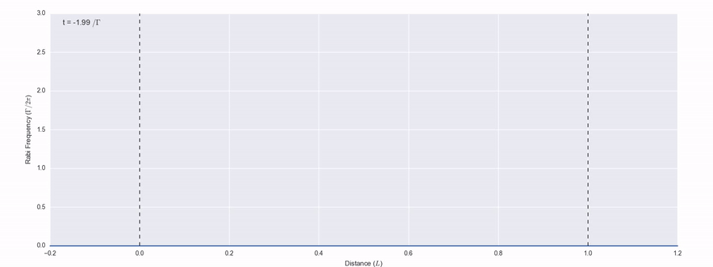

# MaxwellBloch

By [Thomas P Ogden](mailto:t@ogden.eu).

MaxwellBloch is a Python package for solving the coupled Maxwell-Bloch
equations describing the nonlinear propagation of near-resonant light through
thermal atomic vapours.



Above is an [example solution][4pi] for the propagation of a 4π pulse through a
dense atomic vapour. The pulse immediately breaks up on entering the medium and
the resultant pulses form two optical solitons each with a pulse
area of 2π.

[4pi]: https://github.com/tommyogden/notebooks-maxwellbloch/blob/master/examples/mb-solve-two-sech-4pi.ipynb

## Install

I recommend using Conda environments. MaxwellBloch requires NumPy and SciPy,
which can be installed via

    conda install numpy scipy

and QuTiP, which can be installed via

    conda install -c jrjohansson qutip=3.1.0

The MaxwellBloch package can then be installed using `pip`

    pip install maxwellbloch

 or manually download and install the [latest release](https://github.com/tommyogden/maxwellbloch/releases).

## Tutorial

A series of tutorial notebooks is in development here:

https://github.com/tommyogden/notebooks-maxwellbloch#tutorial

## Examples

If you prefer to learn by example, there are a large number of example
notebooks available here:

https://github.com/tommyogden/notebooks-maxwellbloch#examples

Tools for making videos and gifs (like the one above) of the solved field
propagation are available here:

https://github.com/tommyogden/notebooks-maxwellbloch#tools

## Scripts

### `bin/make-fixed-frame-mp4.py`

This Python script takes an MBSolve problem defined in a JSON file and outputs
an MP4 video showing the propagation.

```
optional arguments:
  -h, --help            show this help message and exit
  -f FILE, --file FILE  Path of input file.
  -c SPEED_OF_LIGHT, --speed-of-light SPEED_OF_LIGHT
                        Speed of Light in the system units. (Default: 0.1)
  -m Y_MIN, --y-min Y_MIN
                        Minimum of the y-axis. (Default: 0.0)
  -y Y_MAX, --y-max Y_MAX
                        Maximum of the y-axis maximum. (Default: 1.0)
  -z ZOOM, --zoom ZOOM  To use interpolation on the output data, select the
                        order of interpolation. (e.g. 2, 4). Note this may
                        introduce numerical artefacts. (Default: 1)
```

Only the path of the input file is required.

### `bin/make-ffmpeg-gif.sh`

**Requires [FFmpeg][ff]**. This bash script takes an MP4 file output from
make-fixed-frame-mp4.py and converts it to an animated gif file.

```
optional arguments:
  -f FILENAME, --file FILENAME
                        Path of input MP4 file.
  -n INSCALE, --in-scale INSCALE
                        The width in pixels of the input. (Default: 900)
  -s SCALE, --scale
                        The width in pixels of the output gif. (Default: 900)
  -i INFPS, --in-fps
                        The frames-per-second of the input MP4. (Default: 30)
  -p FPS, --fps FPS
                        The frames-per-second of the output gif. (Default: 30)
```

Only the path of the MP4 file is required.

[ff]: https://www.ffmpeg.org/

## Documentation

On the way…

## Changelog

See [CHANGELOG.md](CHANGELOG.md).

## License

MIT License. See [License.txt](LICENSE.txt).
